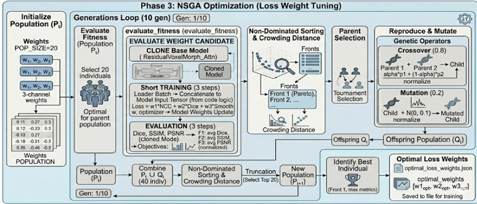
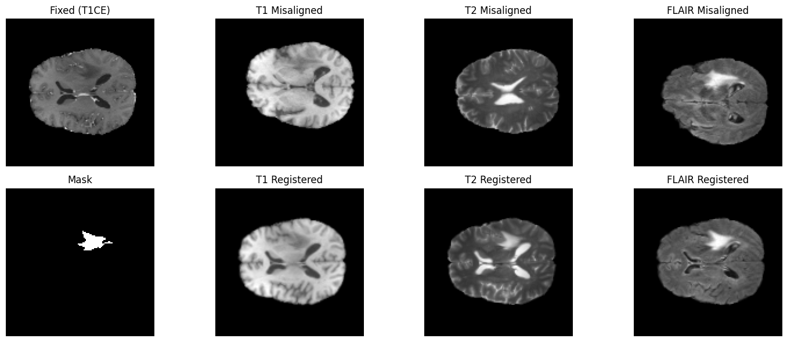

# Hybrid Affine–Residual Deep Learning Framework for Tumor-Aware Multimodal Brain MRI Registration with NSGA-Based Loss Optimization.

# 🧠 Brain MRI Registration using NSGA Optimization

[]
[]
[]
[]

🚀 Hybrid Affine–Residual Deep Learning Framework for
Tumor-Aware Multimodal Brain MRI Registration.

## 📌 Overview
This project presents a hybrid deep learning framework for multimodal brain MRI registration integrating classical affine alignment with residual deformation learning using an enhanced 3D VoxelMorph architecture.

The method introduces tumor-aware spatial attention and automatic loss weight optimization using NSGA to improve pathological region alignment.

## ✨ Highlights
- Hybrid Affine + Deep Registration
- Tumor-Aware Spatial Attention
- NSGA Loss Optimization
- Multimodal MRI Alignment

---

## 🧠 Dataset
**BraTS 2020 Dataset**

Modalities used:
- T1
- T2
- FLAIR
- T1CE (Fixed Reference)

Tumor segmentation masks are used for pathology-aware learning.

---

## ⚙️ Methodology

### 1. Preprocessing
- NIfTI MRI loading
- Intensity normalization
- Spatial resizing
- Dataset standardization

### 2. Hybrid Registration
- Mutual Information–based Affine Registration
- Dense Affine Flow Field Generation
- Residual Attention VoxelMorph Network

### 3. Tumor-Aware Learning
- Tumor mask guided spatial attention
- Pathology-focused feature learning

### 4. Multi-Modal Joint Registration
Simultaneous alignment of:
- T1
- T2
- FLAIR → T1CE reference

### 5. Multi-Objective Optimization
Loss functions:
- Image Similarity Loss
- Dice Loss
- Smoothness Loss

Optimized using:
**Non-Dominated Sorting Genetic Algorithm (NSGA)**

---

## 🚀 Key Contributions
- Hybrid Affine + Deep Residual Registration
- Tumor Mask–Guided Spatial Attention
- Unified Multimodal Registration Network
- Automatic Loss Weight Optimization using NSGA

---

## 🏗 Architecture




## 🔬 Results

| Before and After Registration |
|-------------------------------|
|   |

## ▶️ How to Run

### 1. Clone Repository
```bash
git clone https://github.com/Balamurugan-Mani04/Brain-MRI-Registration-NSGA.git

pip install -r requirements.txt

## 📦 Reproducibility

Dataset: BraTS 2020  
GPU: NVIDIA RTX / CUDA  
Framework: PyTorch  

Steps:
1. Download BraTS dataset
2. Update dataset path
3. Run notebook

Results

The proposed hybrid framework improves tumor-region alignment and multimodal anatomical consistency.

Author

Balamurugan M
B.Tech – Information Technology
PSG College of Technology

## 📖 Citation

If you use this work, please cite:

```bibtex
@misc{balamurugan2026,
  title={Hybrid Affine–Residual Deep Learning Framework for Tumor-Aware Multimodal Brain MRI Registration with NSGA-Based Loss Optimization},
  author={Balamurugan M},
  year={2026},
  url={https://github.com/Balamurugan-Mani04/Brain-MRI-Registration-NSGA}
}
```